#  Shelves store monitoring robot

## Introduction
This project focus on creating a mobile robot that can monitor shelves information like the shortage of goods, or misplaced goods 

## Contributors
- Vu Quoc Khanh : EKF SLAM, EKF Localization, Path-tracking algorithm
- Dao Anh Phi : Circuit design, STM32F103C8T6 firmware, GUI with QT5 on python
- Dang Van Vinh : Camera handling, image processing algorithm, Yolov8 model, Yolov8 training data
  
## Features
- Using 2-wheel mobile robot
- Speed control with STM32F103C8T6
- Lidar with Extended Kalman Filter SLAM algorithm for creating features map and define path for robot movement, Extended Kalman Filter localization for position tracking, path-tracking algorithm
- ESP32 Camera for gathering shelves information
- Using Yolov8 model combining with robot position to determine shelves states 
- A gui based on QT5 framework for observing the state of the shelves in real-time, toggling the states of the shelf 

## System Overview
### Block Diagram
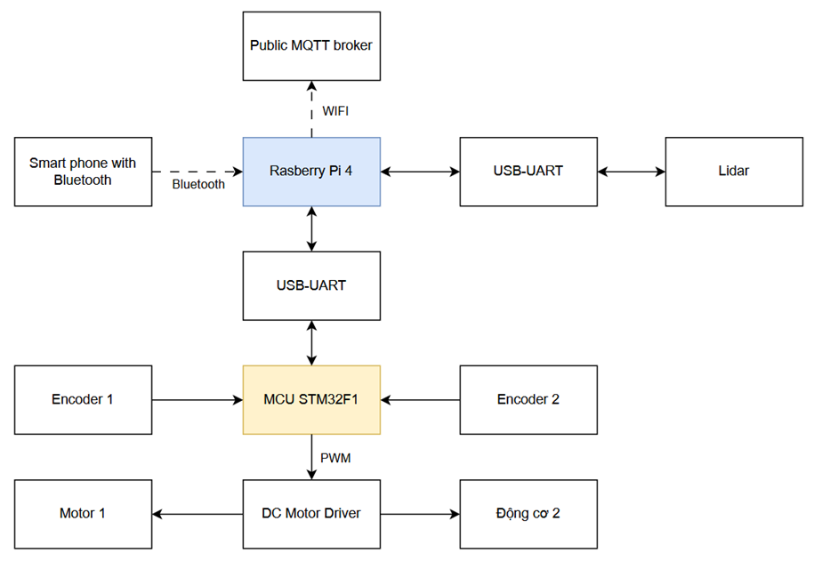
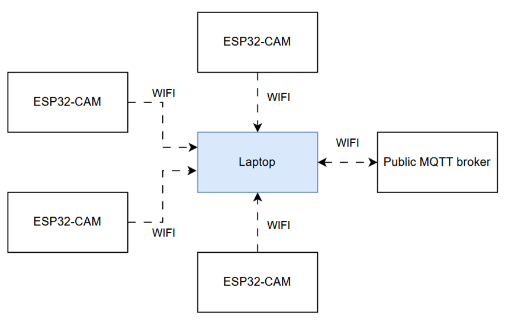

### Components
- **Microcontroller**: STM32F103C8T6
- **Motor**: JGB37-520 12V 37RPM
- **Power Supply**: 3S 45C Lipo-battery
- **Power Regulator**: LM2596S
- **Embedded computer**: Raspberry Pi 4
- **Observation sensor**:RPLidar A1
- **Camera**: ESP32 Camera

## Hardware Design
https://github.com/Anh-phi-ngu-IT-Dien-tu/DATN_Nhung_Firmware_Raspberrypi/tree/Motor_PCB_Design
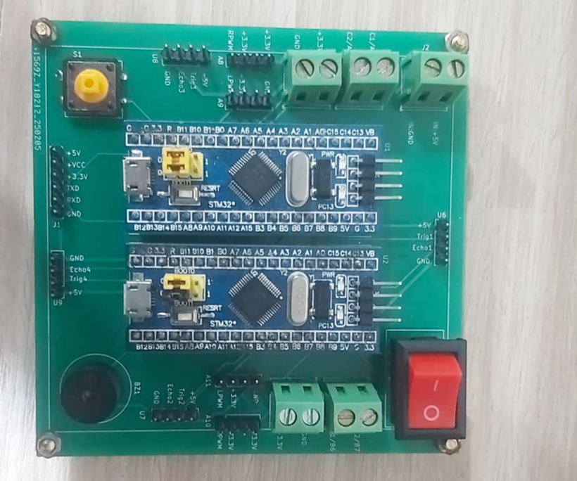

## Software Design
### Android app for controlling robot while defining map, robot path
https://github.com/Anh-phi-ngu-IT-Dien-tu/DATN_Nhung_Firmware_Raspberrypi/tree/Android_app
### STM32F103C8T6 Firmware
https://github.com/Anh-phi-ngu-IT-Dien-tu/DATN_Nhung_Firmware_Raspberrypi/tree/Motor
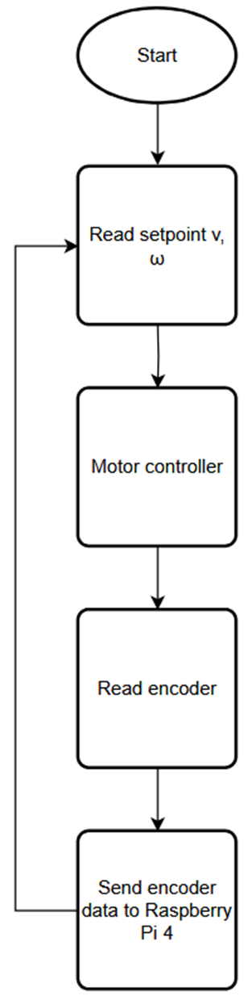
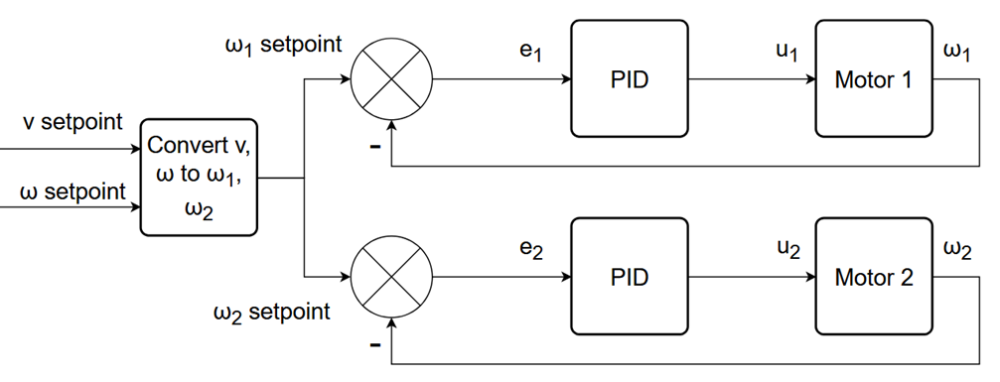
### EKF Algorithm (On Raspberry pi 4):
https://github.com/Anh-phi-ngu-IT-Dien-tu/DATN_Nhung_Firmware_Raspberrypi/tree/Raspberrypi
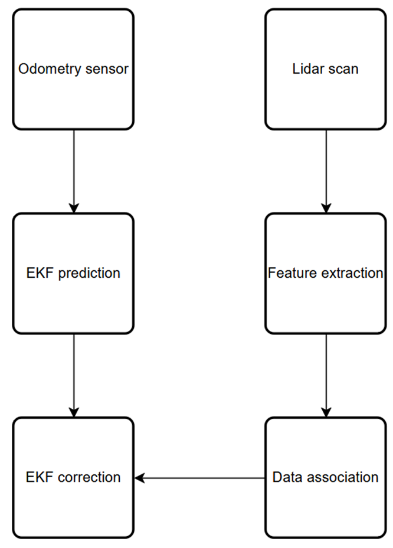
#### Feature extraction (On Raspberry pi 4):
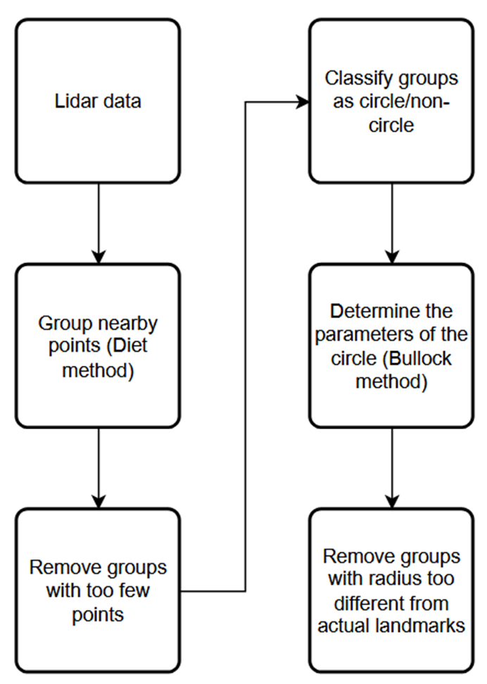
#### EKF SLAM for defining map, robot path
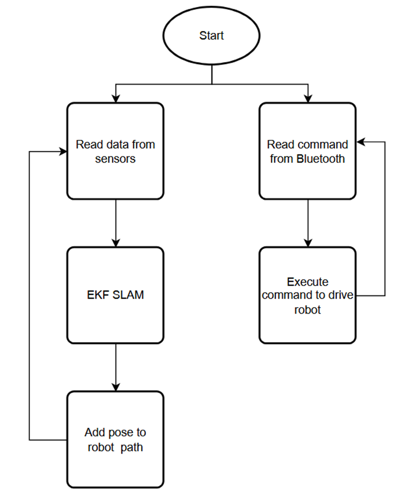
#### EKF Localization for tracking robot positiom
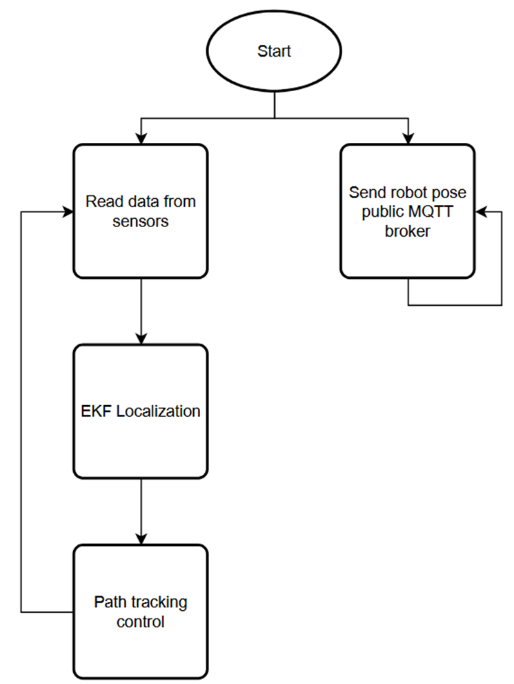
#### Path-tracking with P controller
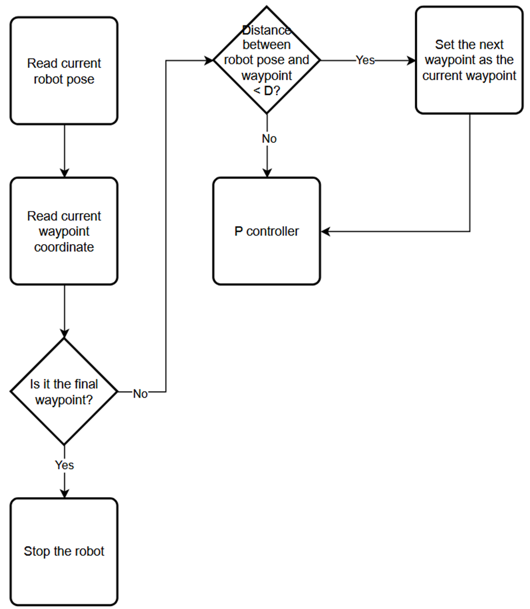
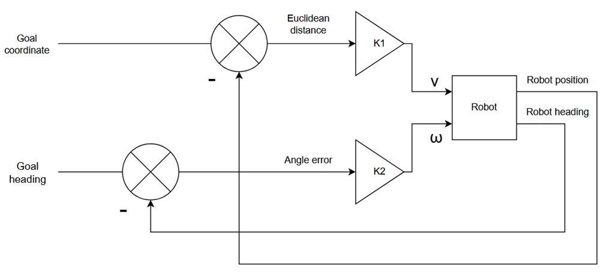
### Image processing algorithm
https://github.com/Anh-phi-ngu-IT-Dien-tu/DATN_Nhung_Firmware_Raspberrypi/tree/Vision_Part
#### Camera handling algorithm
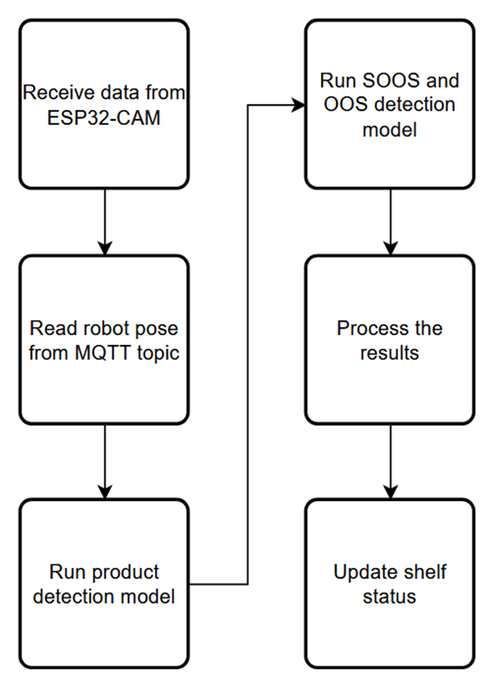
#### Yolov8 data 
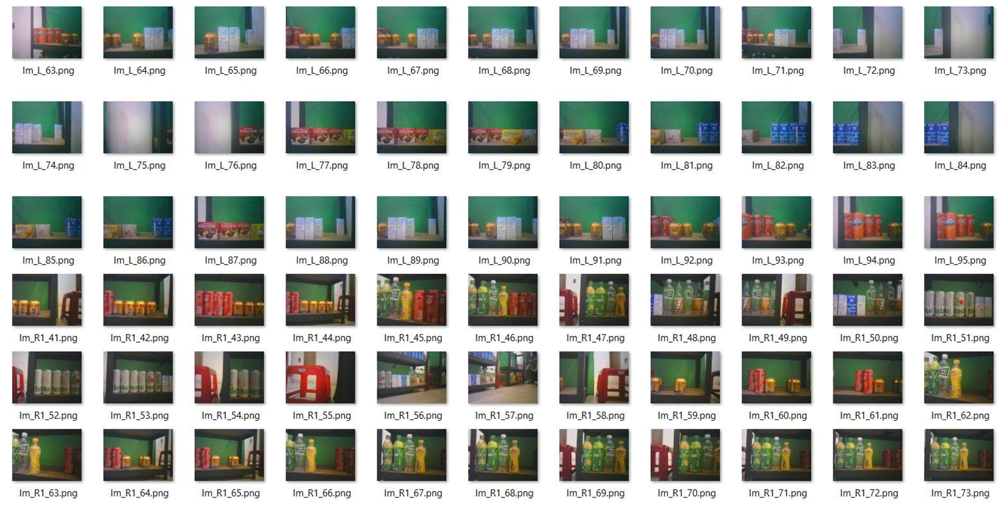
#### Yolov8 models, classes
- **Object detection model**: 21 class: 247, Chinsu, ChocoPie, D.Thanh, Heineken, Oreo, Pepsi-xanh, Redbull, Revive-chanh,Simply, TH true Milk, Tea Plus, Vinamilk, coca, coca-chai, custas, fanta-cam, khongdo, number1, sting, vinhhao
- **Almost out, out detection**: 2 class: oos (Out of stock) and semi-oos (Semi out of stock)
### GUI
https://github.com/Anh-phi-ngu-IT-Dien-tu/DATN_Nhung_Firmware_Raspberrypi/tree/Python_GUI 
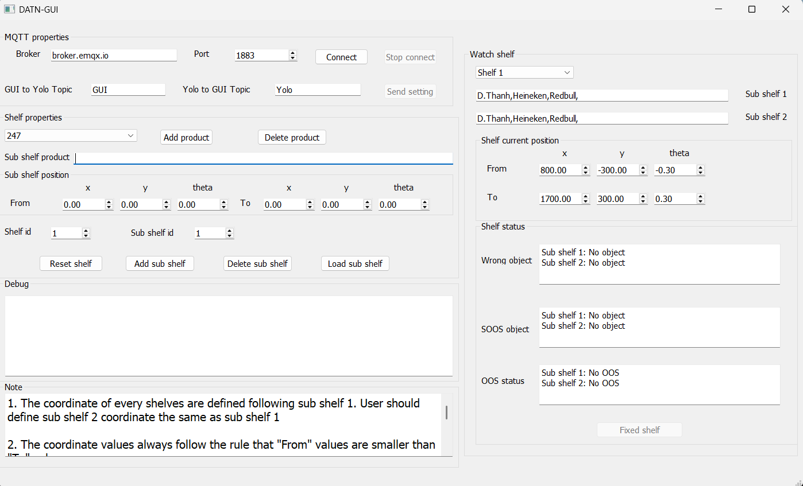

## Landmark
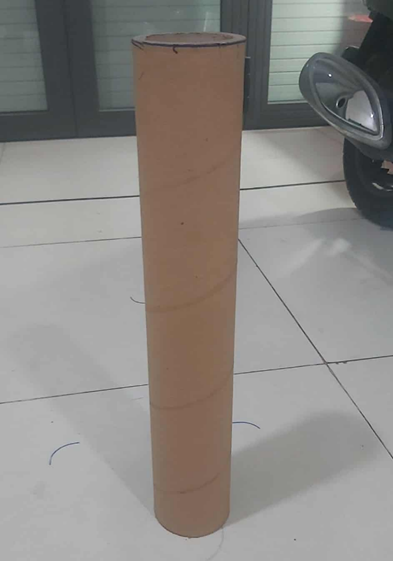

## Results and Evaluation
https://youtu.be/jIvI4DPsrL0?si=AIefCEjHjDwL9q_E

### Advantages
- Reducing observation cost
- Yolov8 model can work with high confidence
- Robot can move around the store the way we want

### Limitations
- Time consumption for setup steps
- There are some small error for feature-based landmark 
- The path-defining algorithm is too dependent to the operation who controlling the robot with bluetooth app
- The overall image processing algorithm can not determine the complicated situations
- The GUI still not enough user-friendly
